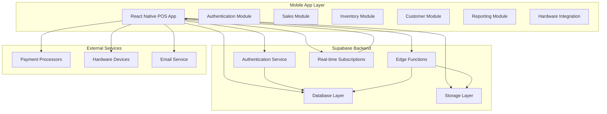

# Retail POS System Architecture

## System Overview

A comprehensive React Native/Expo POS application with Supabase backend, designed for retail operations with full inventory management, sales tracking, and customer management capabilities.

## Technology Stack

### Frontend
- **React Native** with **Expo** for cross-platform mobile development
- **TypeScript** for type safety
- **React Navigation** for navigation
- **React Query** for data fetching and caching
- **React Hook Form** for form management
- **NativeBase** or **Tamagui** for UI components
- **Expo Camera** for barcode scanning
- **React Native Bluetooth** for hardware integration

### Backend
- **Supabase** for database, authentication, and real-time features
- **PostgreSQL** database
- **Supabase Auth** for authentication
- **Supabase Storage** for file storage
- **Supabase Edge Functions** for serverless functions

### Payment & Hardware Integration
- **Stripe** for card payments
- **Bluetooth APIs** for receipt printers and cash drawers
- **Camera API** for barcode scanning
- **Native device APIs** for payment terminal integration

## System Architecture

## Database Schema Design

### Core Tables

#### Users & Authentication
- `profiles` - User profiles with role assignments
- `user_sessions` - Active user sessions
- `permissions` - Role-based permissions

#### Products & Inventory
- `categories` - Product categories
- `products` - Product catalog
- `product_variants` - Size/color variants
- `inventory` - Stock levels by location
- `inventory_transactions` - Stock movement history

#### Sales & Transactions
- `sales` - Sales transactions
- `sale_items` - Line items in sales
- `payments` - Payment records
- `payment_methods` - Available payment types
- `gift_cards` - Gift card management

#### Customers
- `customers` - Customer information
- `customer_addresses` - Shipping/billing addresses
- `customer_loyalty` - Loyalty program data

#### Reporting & Analytics
- `daily_reports` - Daily sales summaries
- `shift_reports` - Shift-based reports
- `audit_logs` - System activity logs

## User Roles & Permissions

### Admin
- Full system access
- User management
- System configuration
- All reporting access

### Manager
- Inventory management
- Staff scheduling
- Reporting and analytics
- Customer management
- Price adjustments

### Cashier
- Process sales transactions
- Basic customer lookup
- Cash handling
- View basic reports

### Inventory Clerk
- Stock management
- Product catalog maintenance
- Inventory adjustments
- Receive shipments

## Key Features Implementation

### 1. Authentication & Authorization
- JWT-based authentication via Supabase Auth
- Role-based access control (RBAC)
- Session management with automatic refresh
- Biometric authentication support

### 2. Real-time Features
- Live inventory updates
- Real-time sales dashboard
- Multi-device synchronization
- Offline mode with conflict resolution

### 3. Payment Processing
- Multiple payment method support
- Split payments
- Tip processing
- Refund management
- Gift card integration

### 4. Hardware Integration
- Bluetooth receipt printer support
- Barcode scanner integration
- Cash drawer control
- Payment terminal integration
- Customer display support

### 5. Inventory Management
- Automatic stock updates
- Low stock alerts
- Purchase order management
- Supplier management
- Stock transfer between locations

### 6. Customer Management
- Customer profiles
- Purchase history
- Loyalty program
- Store credit management
- Marketing preferences

## Security Considerations

### Data Protection
- End-to-end encryption for sensitive data
- Secure payment processing (PCI compliance)
- Role-based data access
- Audit logging for all transactions

### Application Security
- Input validation and sanitization
- SQL injection prevention
- XSS protection
- Secure API endpoints
- Rate limiting

## Performance Optimizations

### Frontend
- Lazy loading of components
- Image optimization
- Caching strategies
- Bundle size optimization

### Backend
- Database indexing
- Query optimization
- Connection pooling
- Edge function optimization

## Deployment Strategy

### Development
- Expo development builds
- Supabase development environment
- Local testing with emulators

### Production
- Expo Application Services (EAS)
- Supabase production environment
- App Store and Google Play Store deployment
- Over-the-air updates

## Scalability Considerations

### Database Scaling
- Read replicas for reporting
- Database partitioning for large datasets
- Archive old transaction data

### Application Scaling
- Load balancing
- Caching layers
- CDN for static assets
- Horizontal scaling capabilities

## Monitoring & Analytics

### Application Monitoring
- Crash reporting
- Performance monitoring
- User analytics
- Error tracking

### Business Analytics
- Sales performance metrics
- Inventory turnover analysis
- Customer behavior insights
- Staff performance tracking